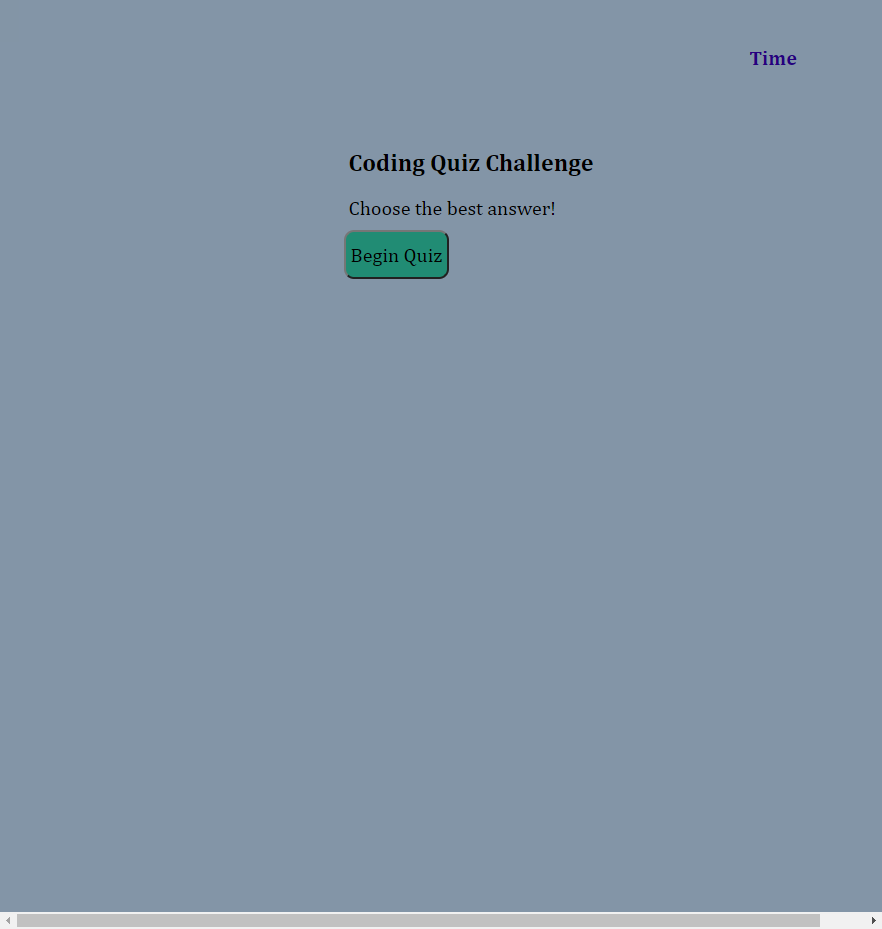
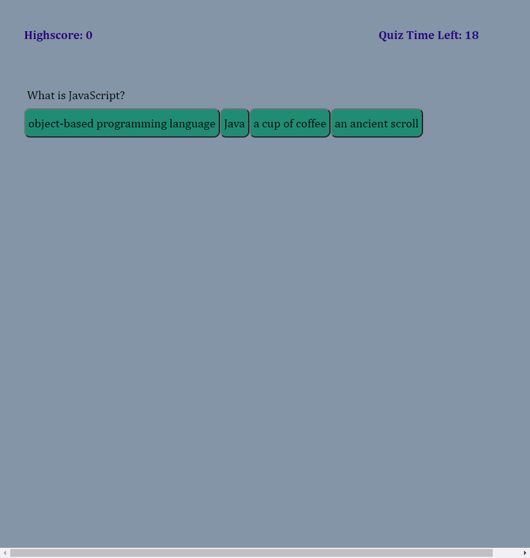

# JSCodingQuiz
## This project was completed to satisfy week 4 homework assignment. This is a fun javascript quiz with a few questions that must be completed before the time is up. During the quiz, if you answer a question incorrectly, time will be subtracted from the total time. At the end, the user can enter their initials to the highscores. 

Unfortunately, I could not get the rest of the code to work the way I wanted to, so scoring features and entering initials are not included. I hope to come back to this project at a later time and correct this. 

# Screenshots

